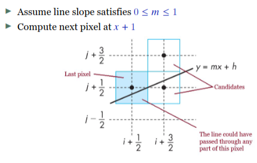

Project:
    C++ 11
    Any external libs
    Must compile on CS linux computers

    Oral presentation:
        Done in groups of 5 students
        Reserve slot online
        Demonstate the software, functionality, system design (and implementation)

# Lecture 1:
## Rasterazation:
rasterazation is the converstion from lines and triangles into screen pixels

We look into the scene from a single point and compute the color for each visable pixel

We use shading to approximate illumination but no raytracing to calculate the acctual lightning.

### Raytracing and Pathtracing

### The 3d scene:
- Objects
- Camera (viewer)
- Light source(s)

### Object specification:
Building blocks:
- vertex -> Edges -> Face/Polygon -> Mesh
Optional:
- Vertex normals (for face normals)
- Texture coordinates

Material properties:
- Defines how objects reflect light
- ex. Opaque, transparen, translucent
        
### Synthetic camera model:
Pinhole camera where the view originates from a single point
Use trigonometry to find projection at point (x,y,z)
    
### Light source:
Point light: light bulb
Spotlight: Light cone
Directional light: Sun
Area light: Larger lamp with a surface

Has a color (intensity/temprature) and often a position
        
Light color + object material = pixel color

### Global vs local illumination
In local illumination we compute color or shade of each object independently
        
### Scene graphs:
If we can represent all the elements of a scene, we can represent the complete scene by a tree called a scene graph

Often some sort of tree: octtree, BSP tree, directed acyclic graph
We could write a generic traversal to render the scene:
- Find what is visible -> fast rendering

## Mesh storage formats
What do we want to achieve:
- Small storage cost
- Fast access to vertex position
- Fast traversal
- Minimal vertex processing
- Fast clipping and filling of polygons
        
### Data structures for meshes
Storage cost
Efficiency
(In c++ use std::vector)

Examples:
- Triangle list
- Triangle strip
- Indexed triangle mesh

### Triangle list
Vertex data is stored for each triangle. Then we have a vector where the first three elements are the 3 vertices of the first triangle

Simplest data structure but duplicated vertices

### Triangle strip
The first three vertices are for the first triangle then the last vertex is also used for the next triangle

No duplication and efficient but complicated preprocessing to represent objects with strips

### Indexed triangle mesh
Seperate vertex data and polygon index

Vertex data is only stored once but we need an index list

`Vertices = {v0,v1,v2,v3,v4,...}`

`Index list = {0,1,2,2,3,4,...}`

We construc triangles from the index list by referencing vertices by index.  

Low storage cost, easy to implement, used by modern graphics api

# Lecture 1,5:
## OpenGL
A computer graphics standard API. Version 3.3 is required for the project but you may use up to 4.4

### Portable
- Consistent visual display regardless of hardware, OS, and windows systems
- Callable from C,C++,Python, Perl, Java, etc
- Runs on all major OS and windows systems

It is well documented with the latest version being 4.6

[Reference cards]()


### GLFW
OpenGL is window independent so we need another system for handeling windows, keybord input and events.

GLFW is open source multiplatform library for OpenGL

## Using OpenGL

### OpenGL building blocks
- Shader processors
- Shader program
- OpenGL graphical context
- OpenGL Objects
- Buffer Object data: Data normally in single percisition floats
- Primitives
- OpenGL buffers

### Shaders
Programmable shaders that are highly customizable, enables GPGPU programming.

Shaders:
- Vertex shader
- Fragment shader
- Tessellation shader
- Geometry shader
- Compute shader

Pipeline:
    Take vertices and do the tansformation on them (to their geometric position). Then assemble the meshes with edges from the information. Then rasterize to find the pixles along the edges and mesh then find the color for the pixels.

    Vertex Data -> Vertex shader -> Tessellation control shader -> Tessellator -> Tessellation evaluation shader -> Geometry shader -> Primitive assembly -> Rasterizer -> Fragment shader -> Depth & Stencil -> Color buffer blend -> Dither -> Frame buffer

### Vertex processor
- Object coordiantes
- World scene coordiantes
- Camera coordinates
- Normal device coordinates
- Screen coordinates

Every Change of coordinates is equivalent to a matrix transformation.

Vertex colors may be computed

### Clipper and primitive assembler
Center of Perspective projects to Back clipping plane. Infront of the view plane that is the screen is a front clipping plane. The things that are rendered are in between the back clipping and front clipping planes.

### Rasterizer
If an object is inside the clipping volume then the razterizer produces a set of fragments for the object. Fragments are potential viewable pixels.

### Fragment processor
Fragments are processed to determined the color of the corresponding pixel in the frame buffer. Then we project everything down to a flat screen.

### Shader languages
First introduced by nvidia geforce 3
Running on the GPU

Specialized programming languages
- OpenGL Shader Language (GLSL)
- High level shader language (HLSL), DirectX
- Metal Unified Graphics and Compute Language
- Cg (deppricated), Nvidia
- etc (Game engines often have a dialect of these)

### GLSL
C-style language. Shader files are linked and compiled by the application

Files usually end with .glsl (or .vert or .frag)

The main() function is the entry point

Input and OUtput variables must be declared globally (before main())

Arrays stored in column-major order

Documentation found in the OpenGL reference pages

### GLSL Built-in funcitons
- Trigonometric functions
- Normalize
- Cross and dot product
- Reflect, refract
- Distance- Clamp, max, min
- etc.

### GLSL datatypes
- Primatives: float, bool, int
- Vectors: vec and ivec
- Matrices: mat

(vec and mat are floating point)

### Vector and Scalar components
- {x,y,z,w} Positions and vectors
- {r,g,b,a} Colors
- {s,t,p,q} Texture coordinates

x = r = s, but they are used to denote what the vector represents.

### GLSL qualifiers
- In, out: Specify in and out parameters to a shader program
- const: Compile time read
- uniform: Global variable for the shader program. They are uniform and wont change during runtime.

### Tessellation shaders
Creates meshes from parametric surfaces. This can control the level of detail (LOD) with subdivision of surfaces and displacement mapping.

### Geometric shaders
- Per-primitive processing
- Create vertices and meshes
- Particle systems
- Surface textures

### Fragment shaders
- Computing colors and texture coordinates per fragment
- Texture application
- Fog computation

### Vertex shader 
A vertex shader must atleast set the variable `gl_Position`. It usually transformas the vertex with the model-view and projection matrices.

The vertex shader
```
in vec4 Vertex;
uniform mat4 ProjectionMatrix;
out vec4 color;

void main() {
    color = vec4(1.0, 1.0, 0.0, 0.5);
   gl_Position = ProjectionMatrix * Vertex;
}
```

In the fragment shader
```
in vec4 color;
out vec4 fColor;

void main() {
    fColor = vec4(color.rg, 0.0, 1.0);
}
```

Accessing the shader attributes: to get the id pointer to a shader variable we use: `glGetAttribLocation()`

### Shader Program
An application can have several shader programs. Each program has its own set of shader files.

We select which program to use with `glUseProgram()`

### OpenGL context
We need to have an active context to render to screen, contexts are local to each application. Contexts are seperated from each other but can share objects between them. One application can have multiple contexts.

### OpenGL objects
Major OpenGL objects:
- Vertex Array Objects: A VAO is used to encapsulate a set of buffer objects
- Buffer objects: Store the data. Bound to a specific target eg, GL_ARRAY_BUFFER
- Index buffer

### OpenGL primitive types
Polygons, triangles, render primitives

# Lecture 2
Linear algebra stuff, check slides.

## Projective geometry  
## Homogenous coordinates
for the line L => ax+by+c=0 we can write the line with a 3-vector as (a,b,c)

and a point P is written with (x,y,1)

Any point on a line fullfills the equation L^T^P = 0

Scaling a line in a homogenous coordinate system doesnt change the line because multiplying both sides of a line equation is the same line. 

If we do the same for a point we dont change its 2d coordinate but we can see it as we are moving the point along a line in 3d (see lecture 2 slide 58). Therefore we can represent a point (u,v,w) with (u/w,v/w)

### Point at infinity
A point with the homogenous coordinate (u,v,0), u and v become infinitly large so it becomes a direction that is defined by the ratio between u and v. 

### Intersection

To find the intersection of two points in the homogenous coordinate system we find the point P that fulfills:

L^T^P = 0

L2^T^P = 0

This is done by taking the cross product between the lines. Because we get a vector pointing orthogonal to both lines which is a line that points out or inwards in the 3d space which looks like a point in 2d.

### Intersection of parallell lines
If we do the same for two parallell lines we get a point at infinity

(0,1,-4) x (0,1,-1) we get the vector (3,0,0)

## Frames
lecture 2 slide 68
### The canonical frame
Consider the canonical frame 

    (1,0,0)
F = (0,1,0)
    
    (0,0,1)

It is the identity matrix with the directions x,y and the point (0,0)

### Geometric transformations
Using homogenous coordinates all important transformations may be written as matrix-vector multiplications

## Carteisian VS Homogenous
summary found on page 73

## Transformations
An object is a set of points.

In 2d the transformation matrix is 3x3

In 3d the transformation matrix is 4x4

### Translation in 2d
Moving points in a uniform direction

Vector v and Point p

the transformaed point q is q = T(v)p

We put the transformation vector v in the last column of a standard matrix and multiply it by the points then the points gets shifted by the vector.

### Scaling and reflection
Isotropic scaling: The same in all directions
anisotropic: One size of scaling in each direction

Isotropic we put the same value in ((a,0,0),(0,a,0),(0,0,1))

anisotropic ((a,0,0),(0,b,0),(0,0,1))

### Reflection
Reflection we inverse x or y or both

A reflection of both x and y in an odd number of coordinate axels, left hand coordinates becomes right handed but with even number of axels it is the same as a rotation in 180^o^

The inverse reflection is the transpose of the reflection matrix. So we can flip back and forth by always tansposing the current reflection matrix.

### Shearing in 2d
Shearing is done by scaling x by a factor of y or y by a factor of x.
Hxy or Hyx where 

Hxy = ((1,a,0),(0,1,0),(0,0,1))

Hyx = ((1,0,0),(a,1,0),(0,0,1))

### Rotation in 2d
R(a) rotates a point counter clockwise by an angle of a

R(a) = ((cosa,-sina,0),(sina,cosa,0),(0,0,1))

The inverse rotation is R^T^

### Concatenation of transformations
We want to do multiple transformations one after another, We can multiply all transformations one efter another to get a resulting matrix that does all the transformations at the same time.

Remember: Matrix multiplication is not comutative, so the order of the transformations matter.

Example: To rotate about a point that is not at the origin. We have the rotation matrix but it can only rotate about origin. So we must first move all points so the point of rotation is at the origin and then rotate and then move the points back.

The inverse of multiple transformations is inverse transformations in the reverse order

transformation ABC has the inverse C^-1 B^-1 A^-1

### Rotation in 3d
We have many conventions for rotating but the important thing to remember is that the other axis are gonna change because of the rotation of the first. Rotating X changes the Y and Z axis so the order matters.

## The Rigid-body transformation
A rigid-body transformation is a transformation that preserves the shape of the object including its size and handedness. Any combination of translations and rotations will be a rigid-body transformation.

it can be written as:

| | |
|---|---|
|(A |b)|
|(0 |1)|

A rigid-body transformation can always be divided into a set of rotation and translation matrices.

## Transformation hierarchy

|||
|---|---|
|A|v|
|w^T|1|

|class|Matrix property|Invariants|
|---|---|---|
|Rigid-body|A inverse is A transpose, w = 0|Lenght, angle, area|
|Similarity|Usinetry+uniform scaling|Angle, Parallellity, shape|
|Affine|A invertible, w=0|Parallellity, incidence|
|Projectivity|T invertible|Incidence|

## Smooth transformations
Typically we find a set of transformation matrices M0, M1, M2 ... 
such that when they are applied in after one another the result is the final transformation we want

but because rotation effects the rotations that comes after, we have a problem.

### Quaternions
We rotate in 4d and use the complex numbers i,j,k where i²=j²=k²=ijk=-1

A quaternion **q** can offten be written as 

---

q = (cos(θ/2), v*sin(θ/2))

**DONT KNOW SEARCH IT UP**

## Transformation of normals
given a vector **V** that is transformed as 

w = TV

how is its normal n transformed

V^Tn = 0

V^T T^T T^-Tn = 0

(TV)^T (T^-T n) = 0

(TV)^T = w^T

(T^-T n) = m

m = T^-T n

---

If T^-1 does not exist we may just adjoint matrix adj(T) instead.

A adj(A) = det(A)I

AA^-1 = I

so if the inverse exists:

adj(A) = det(A)A^-1

if det(A) /= 1, multiplication by adj(A) changes the length of the normalvector

---
What if we dont need the invese?

**T**^-1 = **T**^T then we can use **T** to transform the normal

This is true for rotations, reflections, translations and uniform scaling.

## Transformation of frames
A homogenous point **p** is 

**p** = **p**I

The I is the identity matrix which contains the basis vectors for the canonical frame.

### Example

F = 
||||
|---|---|---|
|1|0|0|
|0|1|0|
|0|0|1|

P = (4,5,1)

Now we rotate by 30^o

FR(30) = 
||||
|---|---|---|
|cos(30)|-sin(30)|0|
|sin(30)|cos(30)|0|
|0|0|1|

For more on transformation of frames. Check Lecture 2 page 143-146

## Rotation about an arbitrairy product
To rotate an object around w, we turn w to a known axis, to the rotation and then rotate back. Because of what was proved in **Transformation of frames** we proved that a rotation matrix set up by 3 orthogonal vectors is a frame rotaion. So if we have 3 basis vectors where w is one of them we can rotate the system to get w to be one of x,y,z axis. We have **w** but we need to find two more orthogonal vectors

We normalize **w** and compute the next orthogonal vector **u** by 

u = (o, -**w**_z, **w**_y) if **w**_x is the smallest

u = (-**w**_z, 0, **w**_x) if **w**_y is the smallest

u = (-**w**_y, **w**_x, 0) if **w**_z is the smallest

Then do the cross product to find the third.

## Summary
|Transformation|Equation|Comments|
|---|---|---|
|Point|q = Tp||
|Normal|m = T^-T n| May use *T* in many cases|
|Frame|G = FT^-1||

## Coordinate systems in CG
main coordinate systems: 
1. Object
2. World
3. Camera
4. Normalized device
5. View port (projection plan)

### Changes of coordinate system
1. Placing an object in world coordinates:

    * Model matrix **M** transforms object coordinates **p** to world coordinates **q**

2. Place the camera in the world

    * View matrix **V** transforms world coordinate **q** to camera (eye) coordinates **R** 

3. Project the scene to normalized device coordinates

    * Projection matrix **P** transforms camera coordinates **r** to NDC

4. Orthogonal projection to the view port

    * Handled by openGL

# Lecture 4
## Object to pixels
### Graphics pipeline
Application -> Vertex shader -> Tesselation -> geometry shader -> Clipping -> Screen mapping(Orthogonal projection) -> Rasterization[Triangle setup -> Triangle traversal] -> Fragment shader -> Merging or Per-fragment operations -> Frame-buffer 
## Culling
### View frustum culling
Removes objects outside the frustum, happens in both cpu and gpu.

Purpose: Render as few objects as possible

Hierarchical processing can be done by using a spatial data structure representing the bounding volume hierarchy.

Also done in the clipping stage on the GPU. But this is later in the process and we want to remove as much as possible in the begining to increase efficiency.
### Occlusion Culling
Removes hidden surfaces and objectes that are blocked by other objects. Usually gpu based but can be a mix as well.

Three categories:
1. Object-space method
    * Work on object itself
    * BSP-trees, planters algorith
    * In the geometry processing stage
2. Image-space method
    * Work on the projected objects
    * In the fragment processing stage
    * Frequently used for real-time rendering
3. Ray space method
    * Work in a dual space

#### Some existing culling methods/algorithms
- Depth buffer method
    - Image-space
    - Algorithm:
        - Initialize the depthbuffer to 1
        - Initialize the framebuffer to background color
        - For each polygon in scene:
            - For each projected polygon pixel calculate depth
            - If the depth is less then at depthbuffer(x,y) the overwrite
            - Calculate the color with the new depthvalue
- Hierarchical z-buffering
- Occlusion queries


### Backface culling
Removes surfaces that are facing away from the view

Calculate the dot product of the face normal, calculated from the vertices in counter clockwise order. If the dot product is negative then the face is pointing away from the perspective(camera)

See slide 15 

## Clipping
All faces that intersect the boarder of the NDC cube are clipped.
If needed new vertices and triangles are created.

### Cohen-Sutherland algorithm
Divide the space into nine areas by drawing parallell lines at the right and left of screen and parallell at the top and bottom.

the areas are given codes
||||
|---|---|---|
|1001|1000|1010|
|0001|0000|0010|
|0101|0100|0110|

Denote in which area a line begins and ends. Then by bit operations we can check if a line moves from one area to a neighbouring which means that it does not cross the middle (inside the frame).

### Parametric form / Liang-Barsky Clipping
Use math where the lines are represented as mathematical lines, then we can find where they intersect with the clipping lines at the sides of the frame.

### Bounding box
Create a simpler form that covers the object which can be used when checking if the object should be culled. The simpler shape can only awnser if it should be culled or not. If the simpler shape is clipping the frame, then we use a more detailed clipping on the object.
## Rasterization
Fragment:
* Located at screen coordinates (x,y) as real numbers
* Has depth information and other attributes such as color and texture coordinates
* Attributes determined by interpolating values at vertices

Pixels:
* Pixel location (ix,iy) as interger numbers
* In OpenGL, pixel center located at (𝑖𝑥.5, 𝑖𝑦.5) in screen coordinates
* Pixel color determined later using color, texture, and other vertex
properties in the fragment processing stage

### Line drawing algorithms
* Lines should appear straight, not jagged
* Lines should terminate accurately
* Lines should have constant density
* The line density should be independent of line angle

#### Digital Differential Analyzer (DDA)
Draw line from (𝑥0, 𝑦0) to (𝑥1, 𝑦1)

    LineDDA(int x0, int y0, int xl, int yl) {
        int dx,dy,steps,k;
        float xinc,yinc,x,y;
        dx = x1-x0;
        dy = y1-y0;
        
        if (abs(dx) > abs(dy))
            steps = abs(dx);
        else
            steps = abs(dy);
        
        xinc = dx/steps;
        yinc = dy/steps;
        x = x0; y = y0;
        
        DrawPixel(round(x),round(y));
        
        for (k = 1; k <= steps; ++k) {
            x = x + xinc;
            y = y + yinc;
            DrawPixel(round(x), round(y));
        }
    }

#### Bresenham algorithm
- Efficient
- Implemented in hardware as
one single instruction
- Integer Calculations
- Uses Symmetry
- Eight cases, one for each
octant of the line slope
- Adapted to display circles,
ellipses, and curves

        𝑎 and 𝑏 – distances to pixel
        center
        𝑑 = Δ𝑥(𝑏 − 𝑎)
        𝑑 is an integer
        𝑑 > 0 use upper pixel
        𝑑 ≤ 0 use lower pixel


Recursive generalized algorithm where 𝑑0 = 2Δ𝑦 − Δ𝑥 and
||||
|---|---|---|
|𝑑𝑘+1 = 𝑑𝑘 + |{2(Δ𝑦 − Δ𝑥)| if 𝑑𝑘 > 0|
|            |{2Δ𝑦| otherwise|
        
        LineBresenham(int x0, int y0, int xl, int yl) {
            int x,y;
            int dx,dy,d;
        
            dx = x1-x0;
            dy = y1-y0;
            d = 2*dy - dx;
            y = y0;
        
            for (x = x0; x <= x1; ++x) {
                DrawPixel(x,y);
                if (d > 0) {
                    y = y + 1;
                    d = d - 2*dx;
                }
                d = d + 2*dy;
            }
        }

#### Polygon scan conversion
Look it up but kinda mehh.

## Aliasing


# Lecture Shading
## Flat shading
normal vector for face = (v2-v1) x (v1-v0)

Shading each pixel depending on the face angle

## Gouraud (per-vertex) shading
Shading each pixel by the vertex shader by interpolating between the vertices

Highlight points on the object are prone to artifacts

## Phong (per-pixel) shading
Applied on each point in the vertex shader

Interpolates the normals between the vertices

## Cel shading
Sobel filter and color limit to phong shader

## Multipass shader
### Forward shader
Multiple passes in parallel

Each fragment is processed independently from vertex to lightning
### Deferred shading
Add the lightning to everything at once.

Requires all materials to be stored at the same time = high memory cost

It can not deal with transparency

## Shadows
Realtime shadows:
- Shadow mapping
- Shadow volumes
- ray traced

Static shadows:

### Shadowmapping
Create the shadows by rendering from the light point of view with a Z-buffer.
Then creates a shadow mapp from that information that is a depthmap.

Then render from the camera using the shadowmap calculated by the first pass.

This makes uneven surfaces sometimes have hard shadows on them. So we apply a slope based bias (offset) to the depth test.

Objects far from the light source has lower resolution, to fix this we


# Lecture Parametric curves
### Motivation
Can scale a curve without losing resolution

Compact representation, delegate the complexity in the computation

Local control, not using high degree polynomials because changing one point on the line effects the other segments

## Parametric Polynomial Curves
### Parametric cubic curves
x = x(u), y = y(u), z = z(u), where 0 <= u <= 1

||||
|---|---|---|
|       |(x(u))|c_0^x + c_1^x*u + c_2^x*u² + c_3^x*u³|
|p(u) = |(y(u))|c_0^y + c_1^y*u + c_2^y*u² + c_3^y*u³|
|       |(z(u))|c_0^z + c_1^z*u + c_2^z*u² + c_3^z*u³|

u is not evenly distributed along the curve, half of the length of the curve is not p(0.5)

Types of cubic curves:
- Interpolation
- Hermite
- Bézier
- B-spline

## Interpolating curves
4 points: p0. p1, p2, p3

We asign the points:
- p0 = p(0)
- p1 = p(1/3)
- p2 = p(2/3)
- p3 = p(1)

(p0 p1 p2 p3) = C(u(0) u(1/3) u(2/3) u(1))

P = CU

We can compute C as PU^{-1}

U only depends on the values of u and not the points. Therefore, we can pre compute it

|||||
|---|---|---|---|
|1|-5.5|9|-4.5|
|0|9|-22.5|13.5|
|0|-4.5|18|-13.5|
|0|1|-4.5|4.5|


